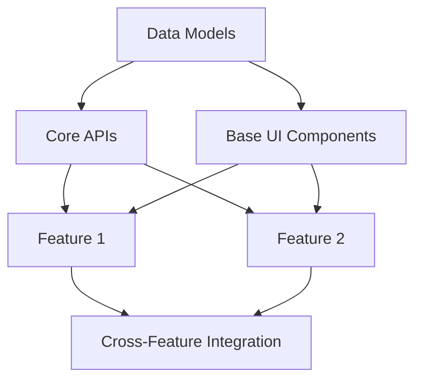

# Phase 1.5: AI-Centric Milestone Planning

## Overview
This phase converts the masterplan into a structured sequence of technical milestones, focusing on dependencies and logical building order. The output guides the AI through systematic implementation of features and components.

## Process

1. Review masterplan.md to extract:
   - Core features
   - Technical components
   - Data structures
   - Integration requirements

2. For each milestone, document:
   - Clear technical objective
   - Input requirements
   - Output/deliverables
   - Direct dependencies
   - Technical considerations

3. Structure milestones in layers:

   a. Foundation Layer
   - Data models and schemas
   - Core utility functions
   - Base API structure
   - Primary UI components

   b. Feature Layer
   - Individual feature implementations
   - Component integrations
   - Data flow implementations

   c. Integration Layer
   - External service connections
   - Cross-feature interactions
   - Data transformation layers

## Milestone Documentation Template

```markdown
# Technical Milestones

## Dependency Graph



## Detailed Milestones

### Foundation Layer
#### M1: Data Models
- Objective: Implement core data structures
- Dependencies: None
- Deliverables:
  - Schema definitions
  - Model relationships
  - Data validation rules

[Continue with other milestones...]

## Technical Considerations
- Data flow patterns
- State management approach
- Error handling strategy
- Performance requirements

## Validation Criteria
- Functional requirements
- Data integrity checks
- Integration points
```

## Key Principles
- Each milestone should have clear, testable outputs
- Dependencies should be explicit and machine-readable
- Focus on technical completeness rather than time estimates
- Maintain logical progression of feature implementation

## Usage in AI Development
1. AI references milestones.md when starting each new implementation phase
2. Uses dependency graph to determine optimal build order
3. Ensures prerequisites are met before starting each milestone
4. Validates deliverables against specified criteria
