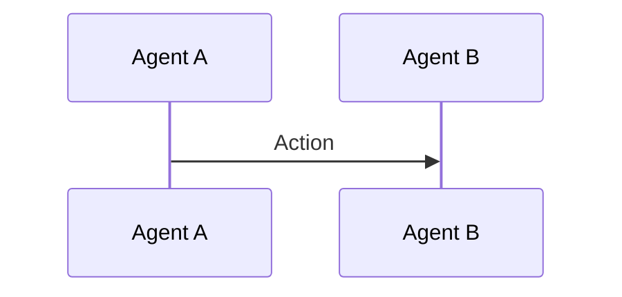

# AGENTS.md

## Build/Test/Lint Commands

This repository contains AI coding mode definitions only. No build, test, or lint commands are applicable.

Mode files are markdown-based configuration files for AI coding agents and IDE integrations (Windsurf, Cursor, etc.).

## File Structure

All mode files are organized in `modes/` with category-based subdirectories:

```
modes/
├── orchestration/     # Workflow coordination modes
├── analysis/          # Code analysis and review modes
├── design/            # Design and specification modes
├── implementation/    # Development and testing modes
├── documentation/     # Documentation generation modes
└── utilities/         # Utility and helper modes
```

## Mode File Format

### Required YAML Frontmatter

```yaml
---
slug: mode-identifier
name: "Display Name"
category: (orchestration|analysis|design|implementation|documentation|utilities)
version: X.Y.Z
groups:
  - read
  - edit:
      fileRegex: pattern
      description: Description
  - command
source: global
---
```

### Frontmatter Fields

- `slug`: hyphenated, lowercase, unique identifier (required)
- `name`: human-readable name with emoji prefix (required)
- `category`: one of the six valid categories (required)
- `version`: semantic version (required, start at 1.0.0)
- `groups`: array of permissions (read, edit, command)
  - `edit` includes optional `fileRegex` for file pattern matching
- `source`: always "global" (required)

## Content Structure

Use XML-tagged sections for organization:

```markdown
<section_name>
Content here...
</section_name>
```

### Common Section Tags

- `<role_definition>` or `<role>`: Define the agent's persona
- `<when_to_use>`: When to invoke this mode
- `<instructions>` or `<process>`: Step-by-step guidance
- `<restrictions>`: What not to do
- `<prerequisites>`: Requirements before starting
- `<workflow>` or `<output_format>`: Structured processes
- `<critical_guidelines>`: Essential rules

## Code Style Guidelines

### Markdown Formatting

- Use ATX-style headers (`# Header`, `## Subheader`)
- Use numbered lists for sequential steps (1., 2., 3.)
- Use bullet points for non-ordered items
- Use code blocks with language specifiers: \```javascript, \```mermaid
- Keep line length under 80-100 characters where possible

### Naming Conventions

- **Slugs**: lowercase, hyphenated (e.g., `tdd-green-phase`)
- **Section names**: lowercase with hyphens (e.g., `<role_definition>`)
- **File names**: match slugs exactly (e.g., `tdd-green-phase.md`)
- **Display names**: Title Case with emoji prefix indicating category

### Emoji Prefixes by Category

- Orchestration: 🤖, 1.
- Analysis: 🤓, 🕵️, 🧮
- Design: 🏛️, 📝
- Implementation: 🔴, 🟢, 🔄, 🧪
- Documentation: 📚, 📋, 💬
- Utilities: 👩🏽‍⚖️, 🗣️, ⚖️

### Workflow Diagrams

Use Mermaid for visual workflows:



## Content Guidelines

### Mode Instructions

- Be specific and actionable
- Provide clear step-by-step processes
- Include examples when helpful
- Define expected inputs and outputs
- Specify any tools or functions to use
- Include success criteria or completion signals

### Phase-Specific Modes (TDD)

For Red/Green/Refactor phases:

- **Red Phase**: Write failing tests only, never edit production code
- **Green Phase**: Write minimal production code to pass tests, never edit tests
- **Refactor Phase**: Improve code without changing behavior
- Always verify tests before/after changes

### Error Handling in Prompts

- Include guard rails for common failure modes
- Specify what should not be done in `<restrictions>` sections
- Include validation steps in processes
- Use scoring systems with point deductions for objective evaluation

## Testing Your Modes

Before committing new or modified modes:

1. Verify YAML frontmatter is valid
2. Check all XML tags are properly closed
3. Ensure slug matches filename
4. Verify category is one of the six valid values
5. Test mode instructions for clarity and completeness
6. Confirm emoji prefix aligns with category

## Integration Notes

These modes integrate with:
- Windsurf global workflows (symlinked to `~/.codeium/windsurf/global_workflows`)
- Cursor custom modes (via `cline_custom_modes.json`)
- Similar AI coding agent systems

Mode files are interpreted by these IDEs as system prompts for specialized agent behaviors.
