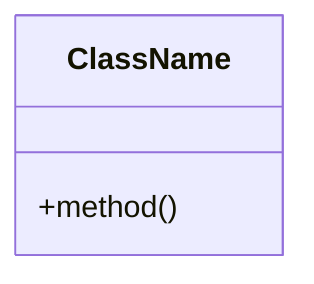

# Modes Reference

Complete reference documentation for all TDD/BDD modes.

## Orchestration Modes

### 🤖 TDD Orchestrator

**Slug:** `tdd-orchestrator`  
**Category:** orchestration  
**Purpose:** Coordinates the complete unit test TDD workflow

**When to Use:**
- Implementing new features with unit tests
- Need automated workflow management
- Feature requires multiple components

**Responsibilities:**
- Breaks down complex tasks into subtasks
- Delegates to specialized modes
- Tracks progress across all phases
- Synthesizes results upon completion

**Available Modes:**
- context-bank-summarizer
- gherkin-generator
- sut-scaffolding
- tdd-red-phase
- tdd-green-phase
- tdd-refactor-phase
- filemap-generator
- context-updater

**Usage:**
```
@tdd-orchestrator "Add user authentication feature"
```

### 🤖 Integration TDD Orchestrator

**Slug:** `integration-tdd-orchestrator`  
**Category:** orchestration  
**Purpose:** Coordinates the integration test TDD workflow

**When to Use:**
- Implementing user journeys across components
- Testing system integrations
- End-to-end feature development

**Responsibilities:**
- Breaks down integration testing tasks
- Delegates to integration-focused modes
- Tracks integration test progress
- Synthesizes integration results

**Available Modes:**
- context-bank-summarizer
- gherkin-generator
- tdd-red-phase-integration-test
- tdd-green-phase-integration-test
- tdd-refactor-phase
- filemap-generator
- context-updater
- prepare-merge

**Usage:**
```
@integration-tdd-orchestrator "Implement shopping cart checkout"
```

## Analysis Modes

### 🔍 Context Bank Summarizer

**Slug:** `context-bank-summarizer`  
**Category:** analysis  
**Purpose:** Analyzes and summarizes project codebase structure

**When to Use:**
- Starting any TDD workflow
- Need to understand existing codebase
- Context gathering before implementation

**Process:**
1. List all files in context bank
2. Read each file
3. Investigate and summarize structure
4. Organize findings logically
5. Report back to orchestrator

**Output:** Structured codebase summary with implementation details

**Usage:**
```
@context-bank-summarizer
```

### 🤓 Code Reviewer

**Slug:** `code-reviewer`  
**Category:** analysis  
**Purpose:** Reviews code for quality, maintainability, and best practices

**When to Use:**
- After implementing features
- Before committing code
- Code quality assessment

**Review Approach:**
Two-phase approach balancing precision and breadth:

**Phase 1 — Focused Local Review (Always)**
- Functionality
- Readability
- Consistency
- Performance
- Best Practices
- Test Coverage
- Error Handling

**Phase 2 — System-Wide Analysis (If Needed)**
Triggers when:
- Affects shared modules or global state
- Changes public interfaces or APIs
- Introduces async logic or side effects
- Impacts state across features
- Raises security/performance/architectural concerns

**Severity Guidelines:**
- **HIGH**: Must fix before release (crashes, regressions, data loss, security)
- **MEDIUM**: Should fix soon (architectural drift, test gaps, performance)
- **LOW**: Optional fix (style, naming, minor smells, docs)

**Usage:**
```
@code-reviewer
```

### 🧮 Security Auditor

**Slug:** `security-auditor`  
**Category:** analysis  
**Purpose:** Scans for security vulnerabilities

**When to Use:**
- Security review of code changes
- Before deploying to production
- Periodic security audits

**Usage:**
```
@security-auditor
```

## Design Modes

### 🏛️ TDD Architect

**Slug:** `architect-mode`  
**Category:** design  
**Purpose:** Designs maintainable, modular, testable architectures

**When to Use:**
- Designing new features
- Architecture decisions needed
- Complex system changes

**Process:**
1. Analyze inputs (context bank, Gherkin scenarios)
2. Propose 2-3 architectural designs
3. Create trade-off table
4. Generate UML diagram
5. Document Architecture Decision Record (ADR)
6. Guide TDD phases
7. Document and wait for approval

**Output Format:**
```markdown
# Architectural Proposal: [Feature]

## Problem Statement
[Description]

## Proposed Solutions
### Solution 1: [Name]
[Description]

### Trade-offs
| Criteria | Solution 1 | Solution 2 |
|----------|------------|------------|
| Maintainability | [...] | [...] |

## UML Diagram


## Architecture Decision Record
- Context: [Why needed]
- Decision: [Chosen solution]
- Consequences: [Impacts, trade-offs, risks]

## Recommended Solution
[Recommendation and rationale]
```

**Usage:**
```
@architect-mode
```

### 📝 Gherkin Scenario Generator

**Slug:** `gherkin-generator`  
**Category:** design  
**Purpose:** Translates user stories into Gherkin scenarios

**When to Use:**
- Starting new feature development
- Documenting requirements
- Creating acceptance criteria

**Guidelines:**
- Write in Given-When-Then format
- Include critical scenarios only
- Cover normal behavior, edge cases, errors
- Ensure requirements are precise and actionable
- Use format: `bdd-[filename].md`

**Scenario Template:**
```markdown
# Scenario 1: [Action-oriented title]
  Given [Initial context/state from user perspective]
    And [Additional context]

  When [Specific user action]
    And [Additional actions]

  Then [Observable outcome]
    And [Additional outcomes]

  ## Acceptance Criteria:
  * [Measurable criterion]
  * [Boundary condition]
  * [Performance aspect]
  * [Error handling]

  ## Edge Cases:
  * Empty/Null Conditions
  * Boundary Values
  * Connectivity Scenarios
  * Interruption Patterns
  * Resource Constraints
  * Permission Variations
  * Concurrency Issues
  * State Transitions
```

**Usage:**
```
@gherkin-generator
```

## Implementation Modes

### 🏗️ SUT Scaffolding Specialist

**Slug:** `sut-scaffolding`  
**Category:** implementation  
**Purpose:** Creates initial structural scaffolding for System Under Test

**When to Use:**
- After Gherkin scenarios are created
- Before writing tests
- Unit test TDD workflow only

**Goal:**
Create non-test source code files with interfaces, types, and minimal stubs containing NO business logic.

**Restrictions:**
- Cannot modify test files
- All code must be stubs (empty or default values)
- NO business logic allowed
- Throw `NotImplementedError` for substantial logic methods

**Workflow:**
1. Analyze BDD scenarios for SUT structure
2. Design contracts (interfaces & types)
3. Create stub implementations
4. Organize directory structure
5. Verify SUT structure

**Usage:**
```
@sut-scaffolding
```

### 🔴 TDD Red Phase Specialist

**Slug:** `tdd-red-phase`  
**Category:** implementation  
**Purpose:** Writes failing unit tests based on Gherkin scenarios

**When to Use:**
- After SUT scaffolding
- Before implementing code
- Unit test TDD workflow

**Goal:**
Write comprehensive, behavior-driven unit tests that all fail because SUT lacks business logic.

**Critical Guidelines:**
- ALL tests must fail (no exceptions)
- Verify 100% fail due to missing business logic
- Mock external dependencies
- Use test inputs designed to fail against stubs

**Restrictions:**
- Cannot modify any other file
- Limited to creating/editing test files only
- NEVER use localStorage/sessionStorage (use React state)

**Test Naming:**
`test_[Scenario]_[Condition]_[ExpectedResult]`

**Test Structure:**
```javascript
describe("Scenario: [Exact BDD Title]", () => {
  let testSystem;

  beforeEach(async () => {
    testSystem = createIntegratedSystem({});
    await testSystem.database.clean();
  });

  afterEach(async () => {
    await testSystem.shutdown();
  });

  test("should [expected outcome]", async () => {
    // Given
    await testSystem.setupUserState({});

    // When
    const result = await testSystem.executeUserJourney({});

    // Then (EXPECTED TO FAIL)
    expect(result.userOutcome).toMatch(expected);
  });
});
```

**Usage:**
```
@tdd-red-phase
```

### 🔴 Integration Test Red Phase

**Slug:** `tdd-red-phase-integration-test`  
**Category:** implementation  
**Purpose:** Writes failing integration tests for user journeys

**When to Use:**
- After Gherkin scenarios
- Before implementing integrations
- Integration test TDD workflow

**Goal:**
Write failing integration tests that verify complete user journeys based on BDD scenarios.

**Key Principles:**
- **User-First Pattern**: Test actual UI components users see
- **Real Dependencies**: Include all real dependencies needed for journey
- **Mock Boundaries**: Mock only at true external system boundaries
- **User Outcomes**: Verify user outcomes and business rules

**Integration Validation Checklist:**
- [ ] Test exercises actual UI component users see
- [ ] Test requires 2+ components to work together
- [ ] Test verifies meaningful user goal from BDD scenario
- [ ] Breaking any critical component would fail the test
- [ ] Test spans multiple layers (UI + logic + data)

**Validate "Good Red" Failure:**
- Error message relates to missing business capability
- Stack trace shows execution through application code
- Failure occurred at business rule assertion
- Failure happened after SUT assembly and interaction

**Usage:**
```
@tdd-red-phase-integration-test
```

### 🟢 TDD Green Phase Specialist

**Slug:** `tdd-green-phase`  
**Category:** implementation  
**Purpose:** Implements minimal code to make failing tests pass

**When to Use:**
- After Red Phase (tests failing)
- Unit test TDD workflow

**Goal:**
Implement the absolute simplest logic required to make tests pass.

**Process:**
1. Review failing tests and prioritize
2. Determine minimal change needed
3. Use `apply_diff` to make changes
4. Avoid editing test files
5. Run tests to confirm they pass
6. Iterate if necessary
7. Complete when all targeted tests pass

**Principles:**
- **Targeted**: Change only code relevant to failing test
- **Simplicity First**: Implement straightforward logic
- **No Side Effects**: Don't introduce unrelated features
- **Smallest Diff**: Aim for smallest possible code change

**Priority Order:**
1. User interaction layer
2. Critical state management
3. Data persistence
4. Business rules enforcement
5. System integration points
6. Error handling

**Code Quality:**
- KISS: Keep it simple
- DRY: Don't repeat yourself
- YAGNI: You ain't gonna need it
- Single Responsibility: One clear purpose
- Testable: Supports the tests

**Usage:**
```
@tdd-green-phase
```

### 🟢 Integration Test Green Phase

**Slug:** `tdd-green-phase-integration-test`  
**Category:** implementation  
**Purpose:** Implements components to make integration tests pass

**When to Use:**
- After Integration Red Phase (tests failing)
- Integration test TDD workflow

**Differences from Unit Test Green Phase:**
- May create multiple files/components
- Implement real integrations between components
- Handle data flow across layers
- Ensure user journeys work end-to-end

**Usage:**
```
@tdd-green-phase-integration-test
```

### ✨ TDD Refactor Phase Specialist

**Slug:** `tdd-refactor-phase`  
**Category:** implementation  
**Purpose:** Improves code while ensuring all tests pass

**When to Use:**
- After Green Phase (tests passing)
- Code needs improvement
- Both unit and integration test workflows

**Goal:**
Enhance code for readability and maintainability without changing behavior.

**Process:**
1. Review production code for opportunities
2. Use `apply_diff` for changes
3. Run tests after each step
4. Continue refactoring incrementally
5. Complete when code is clean and maintainable

**Code Quality Guidelines:**
- KISS: Keep implementation simple
- DRY: Extract reusable patterns
- YAGNI: Only implement what's needed
- Single Responsibility: Clear purpose for each module
- Testable: Code supports integration tests

**Usage:**
```
@tdd-refactor-phase
```

## Documentation Modes

### 📋 Filemap Generator

**Slug:** `filemap-generator`  
**Category:** documentation  
**Purpose:** Creates documentation for staged/modified code files

**When to Use:**
- After completing implementation
- Before committing changes
- Updating project documentation

**Usage:**
```
@filemap-generator
```

### 💬 Chat Summarizer

**Slug:** `chat-summarizer`  
**Category:** documentation  
**Purpose:** Summarizes chat threads for context preservation

**When to Use:**
- Long conversation threads
- Need to preserve context
- Handing off work to others

**Usage:**
```
@chat-summarizer
```

### 📚 Context Updater

**Slug:** `context-updater`  
**Category:** documentation  
**Purpose:** Updates context bank with recent changes

**When to Use:**
- After completing implementation
- After refactoring
- Before starting new features

**Process:**
1. Analyze git logs for recent changes
2. Document modifications
3. Update context bank entries
4. Ensure information is current

**Usage:**
```
@context-updater
```

## Utility Modes

### 👩🏽‍⚖️ Debate Judge

**Slug:** `debate-judge`  
**Category:** utilities  
**Purpose:** Manages debate flow and decides winner

**When to Use:**
- Evaluating multiple design options
- Architectural decision discussions
- Code review debates

**Process:**
1. Track rounds (1-3)
2. Summarize Proponent and Opponent arguments
3. If rounds < 3: switch to proponent for next round
4. If round = 3: evaluate arguments and declare winner
5. Signal debate end

**Usage:**
```
@debate-judge
```

### 🗣️ Debate Proponent

**Slug:** `debate-proponent`  
**Category:** utilities  
**Purpose:** Presents arguments in favor of a position

**When to Use:**
- Debate mode initiated by judge
- Supporting a design decision
- Advocating for an approach

**Usage:**
Invoked automatically by Debate Judge

### ⚖️ Debate Opponent

**Slug:** `debate-opponent`  
**Category:** utilities  
**Purpose:** Presents counterarguments against a position

**When to Use:**
- Debate mode initiated by judge
- Challenging a design decision
- Finding issues with an approach

**Usage:**
Invoked automatically by Debate Judge

## Mode Categories Summary

| Category | Purpose | Modes |
|----------|---------|-------|
| **Orchestration** | Workflow coordination | tdd-orchestrator, integration-tdd-orchestrator |
| **Analysis** | Code analysis | context-bank-summarizer, code-reviewer, security-auditor |
| **Design** | Architecture & specs | architect-mode, gherkin-generator |
| **Implementation** | Dev & testing | sut-scaffolding, tdd-red-phase, tdd-green-phase, tdd-refactor-phase, integration test phases |
| **Documentation** | Docs generation | filemap-generator, chat-summarizer, context-updater |
| **Utilities** | Helper functions | debate-judge, debate-proponent, debate-opponent |

## Permissions

Modes define their permissions in the `groups` field:

- **read**: Can read files
- **edit**: Can edit files (may include `fileRegex` restrictions)
- **command**: Can execute commands

**Example:**
```yaml
groups:
  - read
  - edit:
      fileRegex: ^(?!.*\.test\.(js|tsx|ts)$).*\.(js|tsx|ts)$
      description: JS and TSX files excluding test files
  - command
```

This mode can read all files, edit JS/TSX files (excluding test files), and execute commands.
