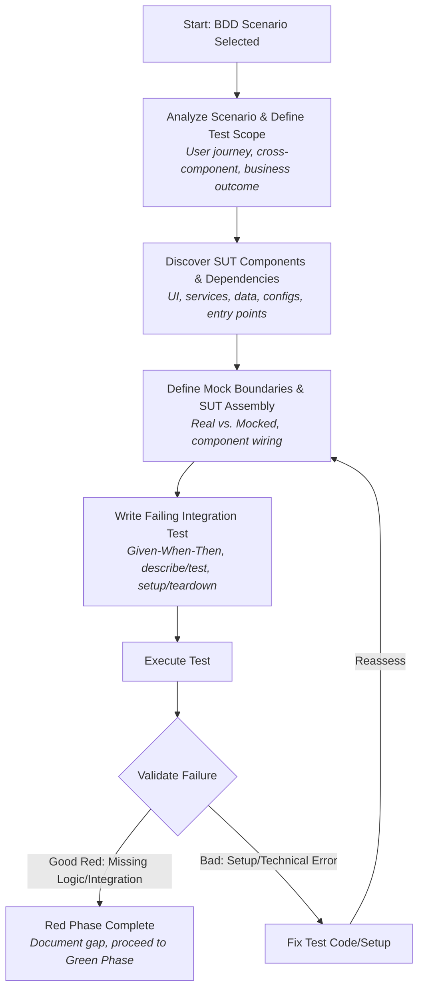

<red-phase-integration>
# 🔴 Integration Test Red Phase (BDD-Driven)

## Core Objective
Your primary goal is to write **failing integration tests** that verify complete user journeys based on BDD scenarios. These tests *must* initially fail because the necessary business logic, component interaction, or system-level state management for the user journey is not yet implemented or correctly wired. Focus on testing user behavior and business requirements, not technical implementation details of individual components.

**This guide is exclusively for the RED PHASE of INTEGRATION Test-Driven Development.** It assumes that individual components might have their own passing unit tests, but their combined behavior to fulfill a user journey has not yet been verified or implemented.

## Red Phase Integration Test Workflow Overview


## Prerequisites for This Task
You MUST be provided with:
-   **BDD Scenarios:** (Given-When-Then format with acceptance criteria). These are the source of truth for the user journeys to be tested.
-   **Access to Codebase Information:** To identify application entry points, UI components, services, state management, persistence layers, and authentication/authorization mechanisms relevant to the BDD scenarios.

---

## Step 1: Analyze BDD Scenario & Define Integration Test Scope

### 1.1. Deep Dive into the BDD Scenario
For the chosen BDD scenario:
-   Read the Given-When-Then statements thoroughly.
-   Identify the complete user journey from the system's entry point to the final expected outcome.
-   Extract all acceptance criteria, especially those that imply interaction between multiple components or systems.
-   Map user actions described in the scenario to potential touchpoints across different components/layers of the application (UI, services, data).
-   Pinpoint parts of the scenario that necessitate system-level state persistence or data flow across components.

### 1.2. Confirming the Need for an Integration Test
While this guide is for integration tests, ensure the chosen BDD scenario truly warrants one by looking for these hallmarks (use this as a checklist for confirmation, not for deciding *between* unit/integration at this stage):

-   **User action spans multiple components/services:**
    -   ✅ EXAMPLE: "User with subscription accesses protected content" (involves ProtectedLayout + SubscriptionContext + RepositoryContext).
-   **Business rule requires coordination between different systems/layers:**
    -   ✅ EXAMPLE: "User without subscription gets redirected to paywall" (involves Route protection + subscription validation + navigation).
-   **User journey crosses clear system boundaries or layers:**
    -   ✅ EXAMPLE: "User completes onboarding and accesses main app" (involves Onboarding completion state + subscription check + route access).

**Contrast with Unit Test Scope (for context only):**
Unit tests typically cover:
-   Testing single component behavior.
-   Business logic within one service.
-   Pure functions and calculations.
-   Component rendering and props (in isolation).
-   Individual validation rules.
    *   Unit Example: "User form validation works correctly."
    *   Integration Example: "User registration creates account AND sends email AND logs audit event."

### 1.3. Adhere to User-First Pattern for Integration
**PRINCIPLE**: Build integration tests from the USER INTERFACE (or system entry point) outward, not from isolated pieces inward.

**✅ USER-FIRST PATTERN (Creates Real Integration):**
1.  Start with the actual user-facing component or system entry point relevant to the BDD scenario.
2.  Identify and include all *real* dependencies that component needs to function for the journey.
3.  Mock only at *true external system boundaries* (e.g., third-party APIs) or as strategically defined (see Step 3).
4.  The test will verify user outcomes and business rules, not internal component communication details.

**❌ BOTTOM-UP ANTI-PATTERN (Creates False Integration - AVOID):**
1.  Starting with an isolated service/context/provider.
2.  Creating a test-only component just to access it.
3.  Testing that the isolated piece works. This is closer to unit/component testing.

### 1.4. Integration Validation Checklist (Apply to your planned test)
Before proceeding, ensure your planned integration test will meet these criteria:
-   [ ] Test exercises an actual UI component users see in production (or a real API endpoint/CLI command) relevant to the BDD scenario.
-   [ ] Test requires 2+ independently-developed components/services/layers to work together to fulfill the scenario.
-   [ ] Test verifies the user can achieve a meaningful goal or outcome described in the BDD scenario.
-   [ ] Breaking any single *critical* component in the integrated chain for that journey would cause the test to fail.
-   [ ] Test spans multiple layers (e.g., UI + business logic + data persistence attempt).

---

## Step 2: Discover SUT (System Under Test) Components & Dependencies

For the BDD scenario, identify all SUT components and their dependencies. This involves understanding which parts of the codebase are involved in the user journey.

### 2.1. Identify Key Files and Modules:
-   **Application Entry Points:** Main screens, pages, API route definitions, or CLI interface handlers that initiate the user journey.
-   **User Interaction Surfaces:** UI components, API controllers/handlers, CLI command modules.
-   **State Management Layer:** Data stores, contexts, services responsible for business logic and state.
-   **Persistence Layer Contracts:** Storage interfaces, database schemas, repositories.
-   **Authentication/Authorization:** User session management, permission checks.
-   **Configuration Files:** Environment configs, database schemas, routing definitions, and other infrastructure files.

### 2.2. Dependency Discovery Techniques:
Use code searching tools and analysis to locate all files and modules needed for the BDD scenario.
-   Search for file dependencies: `import`, `require`, `export`, `module.exports` related to components in the journey.
-   Map scenario touchpoints: Search codebase for imports, exports, and references related to each BDD scenario's user journey.
-   Identify integration points: Find where your BDD-tested components connect (database connections, service calls, state management interactions).

**Example Search Commands (adapt [SEARCH_TOOL] and paths):**
```bash
# Pattern 1: Find component dependencies (adjust ComponentName, ServiceName)
[SEARCH_TOOL] "import|require.*[ComponentName]" [SOURCE_DIR]
[SEARCH_TOOL] "export|module.exports.*[ServiceName]" [SOURCE_DIR]

# Pattern 2: Find configuration and infrastructure
[SEARCH_TOOL] "config|env|settings" [SOURCE_DIR] --file-type=[CONFIG_EXT]
[SEARCH_TOOL] "database|db|storage|persistence" [SOURCE_DIR]

# Pattern 3: Find entry points and routing
[SEARCH_TOOL] "main|app|server|router|controller" [SOURCE_DIR]
[SEARCH_TOOL] "route|endpoint|handler" [SOURCE_DIR]

# Pattern 4: Find state management and data flow
[SEARCH_TOOL] "store|state|context|provider" [SOURCE_DIR]
[SEARCH_TOOL] "service|repository|dao" [SOURCE_DIR]
```

**Tech Stack Specific Examples:**
```bash
# JavaScript/TypeScript
grep -r "import.*UserService" src/
find . -name "*.config.js" -o -name ".env"

# Python
grep -r "from.*user_service import" src/
find . -name "settings.py" -o -name "config.py"
```
*(LLM Note: If you have direct filesystem access, execute these. Otherwise, use this as a template to request human assistance or make educated guesses based on code snippets provided.)*

---

## Step 3: Define Mock Boundaries & SUT Assembly Strategy

Based on the BDD scenario and discovered dependencies (Step 2), decide what parts of the SUT will be real and what will be mocked. The goal is to isolate the system being tested from truly external dependencies while testing the integration of *your* application's components.

### 3.1. Enhanced Mock Boundary Decision Matrix

| System Type              | Mock?  | Reason                                      | Examples                                         |
| ------------------------ | ------ | ------------------------------------------- | ------------------------------------------------ |
| External APIs/Services   | ✅ MOCK | You don't control, slow/expensive, unreliable | Payment gateways, email services, 3rd-party analytics |
| Framework Features       | ❌ REAL | Core to user journey, part of your system   | React Router, Django ORM, Spring Security        |
| UI Component Libraries   | ❌ REAL | User-facing, part of experience             | Material-UI, Bootstrap, Ant Design               |
| Test-Specific Infrastructure | ✅ MOCK or ⚪️ REAL (Isolated Instance) | Database (use test DB), File System (use temp dirs) | Test databases, in-memory file systems          |
| Other Internal Services (within your app) | ⚪️ REAL | Usually, these are part of the integration you want to test. Mock only if they represent a *very* distinct, complex subsystem not central to *this specific* journey's test, or to simplify setup dramatically. | Your other microservices, complex internal libraries |

**Key Question**: "Is this system component/service *external* to the core application logic I'm trying to integrate for *this specific user journey*?"
-   Yes, and it's a 3rd party I don't control -> MOCK
-   Yes, but it's another internal system I *could* spin up -> Consider if mocking simplifies this test or if its real behavior is crucial.
-   No, it's part of the direct flow of this user journey -> KEEP REAL

### 3.2. SUT Assembly Strategy:
-   **Wire BDD-tested components together:** Plan how the discovered real components will be connected as they would be in production for this scenario.
-   **Internal mocks (from unit tests) are usually removed:** Replace them with real component connections unless a component is explicitly designated as a mock boundary for this integration test.
-   **Configure real system infrastructure (test instances):** Plan for test databases (schema applied, clean state), isolated file storage, etc.
-   **Preserve external boundaries:** Mocks are primarily for truly external systems (third-party APIs, payment processors).

### 3.3. System Assembly Checklist (Mental check for your planned test setup)
-   [ ] All critical file dependencies for the BDD scenario's journey have been identified.
-   [ ] BDD-tested components are planned to be wired together as they would be in production for this journey.
-   [ ] Mocking points are clearly defined, primarily for external systems.
-   [ ] Test infrastructure (e.g., test database connection strings, API keys for mocked services) is planned.
-   [ ] The user entry point for the scenario will route through the planned integrated stack.

### 3.4. Mocking Best Practices
#### Mock Factory Best Practices (e.g., for Jest)
**Problem**: Mock factories can't reference external variables in some testing frameworks.
**Solution Pattern**:
```typescript
// ❌ AVOID: External references in factory if framework disallows
// jest.mock("external-service", () => ({
//   service: mockExternalVariable // Error: Can't access external scope in some setups
// }));

// ✅ PREFER: Self-contained factories
jest.mock("external-service", () => ({
  service: {
    getData: jest.fn(() => Promise.resolve({ data: "default_mock_data" })),
    authenticate: jest.fn(() => Promise.resolve(true))
  }
}));

// ✅ CONFIGURE mocks in test setup (beforeEach or specific test)
beforeEach(() => {
  const mockService = require("external-service"); // Or import if ESModules
  mockService.service.getData.mockResolvedValue(testSpecificData);
});
```

#### Complete External Service Mocking
**Pattern**: Create mock builders for complex external types to ensure all required fields are present.
```typescript
// ✅ COMPLETE MOCK BUILDER PATTERN
function createMockExternalApiResponse(overrides = {}) {
  return {
    // All required fields with sensible defaults
    id: `mock-id-${Date.now()}`,
    timestamp: new Date().toISOString(),
    status: "success", // Default success
    data: {},
    metadata: {
      version: "1.0",
      source: "test-mock"
    },
    // Allow overrides for test-specific values
    ...overrides
  };
}

// Usage in tests:
mockExternalApiService.fetchUserData.mockResolvedValue(
  createMockExternalApiResponse({
    data: { userId: "user123", isActive: true },
    status: "success"
  })
);
mockExternalApiService.submitOrder.mockResolvedValue(
  createMockExternalApiResponse({ status: "pending", data: {orderId: "orderXYZ"}})
);
```
**Benefit**: Prevents tests from failing due to incomplete mock structures for external services.

#### Partial Mocking Pattern (Example with a Service)
Sometimes, a service interacts with multiple external systems. You might mock some and keep others (or their test doubles) real.
```typescript
const userService = new UserService({
  database: realTestDatabase,          // Real (or test double) - test your queries
  emailClient: mockEmailClient,        // Mock - don't send real emails
  paymentGateway: mockPaymentGateway,  // Mock - don't charge real money
  auditLogger: realAuditLogger,        // Real (or test double) - test audit trail
});
```

---

## Step 4: Write the Failing Integration Test Code

Now, write the actual test code. It should fail because the business logic to make the user journey succeed across integrated components is missing.

### 4.1. Integration Test Naming Pattern
**Format**: `User [action] [outcome] [across system boundaries if clarifying]` or relate directly to BDD Scenario title.
**Examples**:
-   ✅ "User with valid subscription accesses protected dashboard"
-   ✅ "Scenario: User completes purchase and receives order confirmation"
-   ❌ (Too granular/unit-like) "SubscriptionContext provides correct hasAccess value"

### 4.2. Test Organization (File and Describe Structure)
Group tests by complete user journey or feature, mirroring BDD structure.
```javascript
// Group by complete user journey, not individual components
describe("User Feature: [e.g., Premium Content Access]", () => {
  describe("Scenario: [Exact BDD Scenario Title - e.g., User with active subscription views premium article]", () => {
    // Test steps (Given, When, Then) for this specific scenario
  });

  describe("Scenario: [Another BDD Scenario Title - e.g., User without subscription is redirected to paywall from premium article]", () => {
    // Test steps for this scenario
  });
});
```

### 4.3. Test Structure (One Test per Complete Scenario)
Adapt this pseudo-code template to your specific testing framework.
```javascript
// Pseudo-code template - adapt to your testing framework
describe("Scenario: [Exact BDD Scenario Title from BDD file]", () => {
  let testSystem; // Or app, wrapper, etc.

  beforeEach(async () => {
    // Setup: Initialize the SUT for integration testing based on Step 2 & 3.
    // This involves wiring real components and setting up mocks.
    testSystem = createIntegratedSystem({ // This function encapsulates SUT assembly
      // Pass configurations for real services, test databases, and mock instances
      // e.g., database: createTestDatabase(),
      // e.g., services: wireRealServices(), // Connects your actual services
      // e.g., externalMocks: setupExternalMocksForScenario()
    });

    // Ensure clean state for each test if stateful components are involved
    await testSystem.database.clean(); // Example
    await testSystem.cache.clear();    // Example
  });

  afterEach(async () => {
    // Cleanup: Prevent test pollution. Shutdown services, disconnect DBs.
    await testSystem.shutdown();
    await testSystem.database.disconnect();
  });

  test("should [expected user outcome from BDD scenario's 'Then' clause]", async () => {
    // Given: Set up exact preconditions from BDD scenario across the integrated system.
    // This might involve seeding data in a test database, setting up user state,
    // or configuring mocks to return specific values for this scenario.
    await testSystem.setupUserState({ /* ... based on BDD 'Given' ... */ });
    await testSystem.mockedExternalService.primeResponse({ /* ... */ });

    // When: Perform the exact user action(s) from BDD scenario through the SUT.
    // This should trigger the integrated flow.
    const result = await testSystem.executeUserJourney({
      entryPoint: "/some/user/facing/path",
      actions: extractActionsFromBddScenario(), // e.g., click button, submit form
      userContext: authenticatedUser // if applicable
    });
    // OR more direct service calls if testing API integration:
    const response = await testSystem.apiClient.post("/orders", orderPayload);

    // Then: Assert the exact expected outcome from BDD scenario AT THE SYSTEM LEVEL.
    // THIS ASSERTION IS EXPECTED TO FAIL IN THE RED PHASE.
    // Focus on business outcomes, state changes, or user capabilities.
    expect(result.userOutcome).toMatch(expectedOutcomeFromBdd());
    expect(testSystem.database.query("SELECT ... FROM orders WHERE ...")).toMatch(expectedPersistedState());
    expect(testSystem.mockedEmailService.send).toHaveBeenCalledWith(expectedEmailParams());
  });
});
```

**Framework-Specific Setup Examples (Conceptual):**
```javascript
// Jest + Node.js (e.g., Express app)
const { setupTestApp } = require('./test-helpers/app-builder'); // Your helper
beforeEach(() => { app = await setupTestApp({ /* scenario-specific mocks/config */ }); });

// Vitest + Vue
import { mount } from '@vue/test-utils';
import App from '@/App.vue'; // Your main app component
import { createPinia } from 'pinia'; // Or Vuex
beforeEach(() => {
  const pinia = createPinia();
  // Configure pinia with mocks or test state if needed
  wrapper = mount(App, { global: { plugins: [pinia, /* other router/plugins with test config */] } });
});

// pytest + Python (e.g., Flask/Django)
@pytest.fixture
def test_app_client(scenario_specific_settings_override):
    app = create_app(config_overrides=scenario_specific_settings_override)
    with app.test_client() as client:
        yield client
    # cleanup_app(app) if needed
```

### 4.4. Framework-Agnostic Integration Setup Principle
Separate system assembly logic from framework-specific test runner boilerplate.
```typescript
// 1. System Assembly (Framework-agnostic - conceptually)
class IntegratedSystem {
  constructor(config) {
    // config contains DB connections, mock instances, service configurations
    this.userService = new UserService(config.database, config.mockEmailClient);
    this.orderService = new OrderService(config.database, this.userService, config.mockPaymentGateway);
    // ... wire your components as they would be in prod, but with test DBs/mocks
  }
  async performUserRegistration(userData) { /* ... */ }
  async placeOrder(orderData) { /* ... */ }
}

// 2. Test Helper / SUT Factory (Can be framework-specific in how it's called)
function createIntegratedTestSystem(scenarioConfig = {}) {
  const testDb = setupTestDatabase(scenarioConfig.dbSeed);
  const mockEmail = createMockEmailClient(scenarioConfig.emailBehavior);
  const mockPayment = createMockPaymentGateway(scenarioConfig.paymentBehavior);

  const systemConfig = {
     database: testDb,
     mockEmailClient: mockEmail,
     mockPaymentGateway: mockPayment,
  };
  return new IntegratedSystem(systemConfig);
}

// 3. Test (Focus on business logic, using the SUT factory)
test("user registration sends welcome email and creates DB record", async () => {
  const system = createIntegratedTestSystem({
     emailBehavior: { shouldSendWelcome: true },
     dbSeed: { initialUsers: [] }
  });
  const registrationResult = await system.performUserRegistration(newUserData);

  // ASSERTIONS (expected to fail in Red phase)
  expect(registrationResult.success).toBe(true);
  expect(system.mockEmailClient.sentEmails).toContain(welcomeEmailFor(newUserData));
  expect(await system.database.users.findByEmail(newUserData.email)).toBeDefined();
});
```

### 4.5. Assertion Strategy: User Capability & System State (NOT UI Details)
**Critical Distinction**: Test what users can DO (their capabilities, the resulting system state) or what business rules are enforced, NOT superficial UI rendering details. The UI is a means to an end.

❌ **Avoid Rendering-Focused Tests (Brittle & Not True Integration Value):**
```typescript
// expect(getByText("Dashboard Loaded Successfully")).toBeTruthy(); // Tests UI text
// expect(component.find("Button.submitOrder")).toBeEnabled(); // Tests component structure/state
```

✅ **Prefer State/Capability/Business Outcome-Focused Tests (Robust & Business-Valuable):**
```typescript
// // User Capability / Permissions
expect(userSession.hasAccessTo("premium_features")).toBe(true);
expect(app.userPermissions.can("delete_order")).toBe(false);
//
// // Application State / Business Rule Enforcement
expect(app.currentState.orderWorkflow).toBe("PAYMENT_PENDING");
expect(system.businessRules.isOrderLimitExceeded(user)).toBe(true);
//
// // Data Persistence / Side Effects
const orderInDb = await testSystem.database.orders.findById(orderId);
expect(orderInDb.status).toBe("CONFIRMED");
expect(testSystem.mockedAuditLog.getEntries()).toContainEqual({ action: "ORDER_PLACED", userId: "user123" });
//
// // External Interactions (via Mocks)
expect(mockPaymentGateway.charge).toHaveBeenCalledWith(expect.objectContaining({ amount: 1000, currency: "USD" }));
```

**Pattern**: Test what the user can ACHIEVE or what the SYSTEM state becomes as a result of the journey.
This ensures tests are resilient to UI refactors and verify actual business requirements.

#### User Journey Capability & State Progression Patterns:
```typescript
// Pattern 1: Access Control / Route Protection Testing
test("subscription-protected routes require active subscription", async () => {
  // Given: User without active subscription, SUT setup
  const user = await system.setupUser({ hasActiveSubscription: false });
  // When: User attempts to access protected content (e.g., via a simulated navigation or API call)
  const accessAttemptResult = await system.accessProtectedResource("/premium/article/123", user.sessionToken);
  // Then: System enforces business rule (THIS IS EXPECTED TO FAIL IN RED PHASE)
  expect(accessAttemptResult.allowed).toBe(false);
  expect(accessAttemptResult.reasonCode).toBe("SUBSCRIPTION_REQUIRED");
  expect(accessAttemptResult.redirectTarget).toBe("/subscribe/paywall");
});

// Pattern 2: State Transition Testing
test("user progresses through onboarding to account activation", async () => {
  let userState = await system.startOnboardingJourney(newUserEmail);
  expect(userState.currentStage).toBe("EMAIL_VERIFICATION_PENDING");
  expect(userState.canAccess("dashboard")).toBe(false);

  userState = await system.completeEmailVerification(userState, verificationToken);
  // EXPECTED TO FAIL HERE IN RED PHASE if logic isn't implemented
  expect(userState.currentStage).toBe("PROFILE_SETUP_PENDING");
  expect(userState.canAccess("dashboard")).toBe(false);

  userState = await system.completeProfileSetup(userState, profileData);
  // EXPECTED TO FAIL HERE IN RED PHASE
  expect(userState.currentStage).toBe("ACCOUNT_ACTIVE");
  expect(userState.canAccess("dashboard")).toBe(true);
});
```

**Verification Questions for Each Test Assertion You Write:**
1.  "If this assertion passes (eventually, in Green phase), does it confirm a specific part of the BDD scenario's user outcome or acceptance criteria is met?" (Should be YES)
2.  "Does this assertion depend on specific UI text, CSS classes, or component internal structure?" (Should be NO, or minimized)
3.  "Would this assertion still be valid and meaningful if we changed the UI framework or presentation details but kept the business logic?" (Should be YES)

### 4.6. What to Test (Focus for Integration Tests)
-   End-to-end user journeys as defined by BDD scenarios.
-   Correct data flow and state persistence across multiple components/layers.
-   Enforcement of system-level business rules that require coordination.
-   Correct transitions between states/screens/pages as part of a complete user flow.
-   System-wide data consistency after a user journey.
-   Handling of edge cases or error scenarios (from BDD) that involve multiple components.

### 4.7. What NOT to Test (Already Covered or Out of Scope)
-   ❌ Individual component behavior already verified in unit tests.
-   ❌ Detailed framework-specific wiring (e.g., is DI container working? That's framework's job or a very low-level test).
-   ❌ Internal algorithms or logic within a single component/service (unit test's job).
-   ❌ Scenarios that don't actually cross component/service/layer boundaries.
-   ❌ Technical integration just for the sake of it, without clear user-facing value or business rule.
-   ❌ Re-testing component-level BDD scenarios that don't require system integration.

---

## Step 5: Execute the Test

Run your newly written integration test(s).
```bash
# Example commands to run tests (adapt to your project)
[TEST_RUNNER_COMMAND] [PATH_TO_YOUR_INTEGRATION_TEST_FILE_OR_DIR] --verbose

# Tech Stack Examples:
npm test -- --testPathPattern=integration/my-new-feature.test.js
pytest tests/integration/test_my_new_feature.py -k "Scenario: My BDD Scenario" -v
dotnet test MyProject.IntegrationTests/ --filter "FullyQualifiedName~MyNewFeatureTests.Scenario_My_BDD_Scenario"
mvn test -Dtest="com.example.integration.MyNewFeatureIT#scenarioMyBDDScenario"
```
**The test(s) MUST FAIL.** If they pass, something is wrong: either the test isn't specific enough, doesn't correctly target the unimplemented user journey, or the functionality accidentally exists.

---

## Step 6: Validate "Good Red" Failure - CRITICAL STEP

Analyze each test failure meticulously. The goal is to ensure it's a "good red" – failing because the *business logic or integration* is missing, not due to a "bad red" like a typo in the test, incorrect setup, or a fundamental misconfiguration.

### 6.1. Mandatory Failure Analysis Workflow:

**For EACH failing integration test, perform this analysis:**

1.  **Examine the Error Message & Stack Trace:**
    *   **Error Message:**
        *   🚨 **BAD RED Example (Technical/Setup Issue):** `TypeError: Cannot read properties of undefined (reading 'execute')`, `ReferenceError: MyService is not defined`, `Error: Module not found 'some/dependency'`, `ConnectionRefusedError: Could not connect to database`.
        *   ✅ **GOOD RED Example (Business Logic/Integration Gap):** `AssertionError: Expected user to have access to dashboard, but access was denied`, `Expected order status to be 'CONFIRMED', but was 'PENDING'`, `Expected redirect to '/paywall', but got '/home'`.
    *   **Stack Trace:**
        *   🚨 **BAD RED:** Trace points primarily to test setup code, framework internals, or basic module loading issues before your application's business logic is even hit.
        *   ✅ **GOOD RED:** Trace shows execution flowed into your application's components/services (even if they are stubs or incomplete), and the failure occurs at an assertion checking a business outcome or in a part of *your code* that should have handled the integration.

2.  **Apply the "Error Classification Checklist":**
    For the failure:
    -   [ ] Does the error message clearly relate to a missing business capability, user outcome, or data state from the BDD scenario?
    -   [ ] Does the stack trace indicate that the test executed through parts of *your application's actual code* (not just test setup or framework internals) before failing?
    -   [ ] Did the test fail at an assertion that checks a business rule, user capability, or system state (as per Step 4.5)?
    -   [ ] Did the failure occur *after* the SUT (System Under Test) was assembled and basic interactions initiated (i.e., not during initial module loading or basic mock setup)?

3.  **Decision:**
    *   If **ALL checklist items above are YES**: ✅ **PROCEED**. This is likely a "Good Red". Document the identified business logic/integration gap.
    *   If **ANY checklist item is NO**: 🚨 **STOP & FIX**. This is likely a "Bad Red".
        *   Identify the technical issue in your test code, SUT assembly, or mock configuration.
        *   Correct the issue.
        *   Re-run the test (Step 5) and re-analyze (Step 6). Iterate until "Good Red".

### 6.2. Test Infrastructure Health Check (Optional but Recommended Pre-flight)
Before diving deep into many business logic tests, consider a very basic test to ensure your SUT assembly and core mock/real component connections are technically sound. This should PASS.
```typescript
// Example: Minimal Infrastructure Test (should PASS before business logic tests)
describe("Integration Test Infrastructure Health", () => {
  test("SUT assembly completes and core mocks/services are reachable", async () => {
    let system;
    // Attempt to create the integrated system
    expect(() => {
      system = createIntegratedSystem({ /* minimal valid config */ });
    }).not.toThrow();

    expect(system).toBeDefined();

    // Basic mock connectivity (if a core mock is always present)
    expect(system.mocks.externalAuth.ping).toBeDefined();
    await expect(system.mocks.externalAuth.ping()).resolves.toBe("pong_mock");

    // Basic real component/service connectivity (if feasible and simple)
    await expect(system.internalHealthService.checkStatus()).resolves.toBe("OK");
    await expect(system.database.canConnect()).toBe(true);
  });
});
```
If this kind of infrastructure health check fails, it's a clear "Bad Red" that needs fixing before writing more specific business journey tests.

### 6.3. Expected Failing Test Output Examples:

**✅ GOOD FAILURES (Indicate missing business logic/integration):**
```
FAIL  tests/integration/purchase.test.js
● User Feature: Purchase Workflow › Scenario: User completes purchase and receives order confirmation
  › should create an order, send confirmation email, and update inventory

  AssertionError: Expected order status to be 'CONFIRMED', but found 'PENDING'.
      at Object.operator (tests/integration/purchase.test.js:123:45)

  AssertionError: Expected mockEmailService.send to have been called with confirmation template.
      at Object.toHaveBeenCalledWith (node_modules/jest-mock/build/index.js:...)
```

**🚨 BAD FAILURES (Indicate test setup/technical issues):**
```
FAIL  tests/integration/registration.test.js
● User Feature: Registration › Scenario: New user registers successfully
  › TypeError: Cannot read properties of undefined (reading 'createAccount')
      at UserService.register (src/services/userService.js:42:25)
      at Object.when (tests/integration/registration.test.js:55:30)

  ● Test suite failed to run
    ReferenceError: SomeGlobalTestHelper is not defined
      at Object.<anonymous> (tests/integration/setup.js:5:1)
```

### 6.4. Final Red Phase Verification Checklist (Before concluding this Red Phase task)
For EACH integration test written:
-   [ ] The test currently FAILS.
-   [ ] The failure is a "Good Red" (verified via Step 6.1).
-   [ ] The failure message clearly indicates a missing business outcome, capability, or state related to the BDD scenario.
-   [ ] The test name accurately reflects the BDD scenario or user journey.
-   [ ] Test assertions focus on user capabilities or business outcomes, not UI implementation details.
-   [ ] Mock boundaries are correctly established (external systems mocked, internal systems largely real).

---

## Concluding The Red Phase Task

### Red Phase Success Indicators (What you should have achieved)
-   ✅ Every BDD scenario designated for integration testing has a corresponding *failing* integration test.
-   ✅ These tests fail because system-level user requirements or business rules are not yet met by the integrated components.
-   ✅ The tests clearly define the *gap* in functionality for the complete user journey.
-   ✅ Test names and structures map clearly to BDD scenarios.

### Documenting Identified Gaps (For handover to Green Phase)
For each "Good Red" failure, implicitly or explicitly, a business logic or integration gap has been identified. This information is crucial for the Green Phase (implementation).
Example:
```markdown
## Red Phase Business Logic Gaps Identified

### Scenario: User completes purchase and receives order confirmation
-   **Test:** `purchase.test.js > User Feature: Purchase Workflow > Scenario: User completes purchase and receives order confirmation`
-   **Identified Gaps:**
    1.  Order status is not transitioning to 'CONFIRMED' in the database after successful payment processing. Currently remains 'PENDING'.
    2.  No confirmation email is being triggered/sent via the EmailService.
    3.  Inventory levels are not being decremented for the purchased items.
-   **Integration Points Needing Implementation:**
    -   `OrderService` needs to update order status post-payment.
    -   `OrderService` (or a `NotificationService`) needs to invoke `EmailService.sendOrderConfirmation()`.
    -   `InventoryService` needs to be called by `OrderService` to adjust stock.
```

### Common Pitfalls to Avoid (Recap)
-   ❌ Writing tests that pass immediately (means the test is not specific enough or functionality exists).
-   ❌ Tests failing due to technical setup errors (these are "Bad Red" and must be fixed first).
-   ❌ Re-testing component-level logic already covered in unit tests.
-   ❌ Over-mocking *your own application's internal components* that should be part of the integration.
-   ❌ Focusing on UI rendering details instead of user capabilities, business outcomes, and system state changes.
-   ❌ Tests for scenarios that don't actually require cross-component/layer integration.
-   ❌ Proceeding to implementation (Green Phase) if tests are failing for technical/setup reasons. The "Red" must be for a valid business logic gap.

This concludes the instructions for the Red Phase of Integration Test-Driven Development. The output should be a set of failing integration tests that accurately pinpoint the missing functionality for the specified user journeys.
</red-phase-integration>