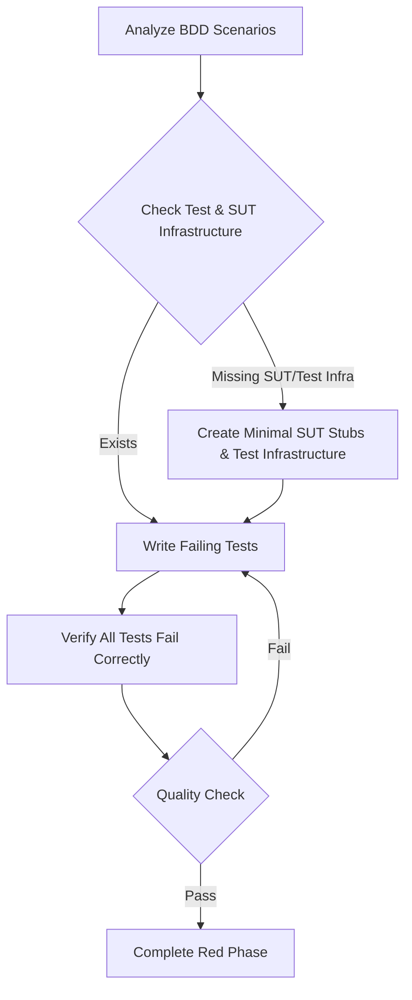

<tdd-red-phase>

### Restrictions
- This phase primarily focuses on creating and editing test files (e.g., `.test.ts`, `.spec.js`, `_test.py`, `Tests.swift`).
- Creation or modification of System Under Test (SUT) source files (e.g., `my-service.ts`, `user-model.py`, `FeatureCoordinator.swift`) is permitted only for the following purposes:
    - Defining interfaces, type definitions, protocols, or abstract classes.
    - Creating minimal function/method signatures or empty class/struct/actor structures.
- These SUT stubs must not contain any business logic that would cause a test to pass. Their sole purpose is to allow tests to compile and articulate the expected contract of the SUT.
- Modifications to existing production code files that are not the direct SUT stubs being created or updated for the current feature are not permitted in this phase.

### High Level Flow


### Critical Guidelines
- ALL tests must fail - no exceptions.
- After writing tests, verify that 100% of tests fail due to missing business logic in the SUT, not due to test setup errors.
- **ONE EXPECTATION PER TEST** - Each test must have exactly one assertion/expectation. No contradictory assertions.
- **NO PROGRESSIVE ASSERTIONS** - Do not write multiple assertions in a single test that expect different outcomes from the same result.
- Mock external dependencies (e.g., APIs, databases, system services) to isolate the unit under test.
- Use realistic data structures in mocks and SUT stubs that cause behavioral failures, not undefined/null returns where a structure is expected (or equivalent nil/empty optionals in typed languages).

---

## Red Phase Workflow

### 0. Pre-requisites
Before writing tests, ensure the necessary test and SUT infrastructure exists:

1. First, locate and read ALL relevant BDD scenarios:
    - Extract required components/modules (SUTs) and their relationships.
    - Note expected behaviors, outcomes, and data contracts.
    - Review implementation notes or architectural considerations.
    - List all acceptance criteria.

2. Check for existing SUT and test infrastructure:
    - [ ] SUT file(s) with basic structure (interfaces, protocols, empty functions/classes/structs).
    - [ ] Test utilities and helpers.
    - [ ] Mock implementations for external dependencies.
    - [ ] Test data generators or shared test fixtures.
    - [ ] Test configuration.

3. Create missing SUT stubs and test infrastructure if needed, following platform conventions and team agreements for organization:
    - SUT Stubs: Create new source files (e.g., `feature.service.ts`, `ProfileViewModel.swift`) or add to existing ones. Include only:
        - Interface/protocol definitions (e.g., `export interface UserProfile { ... }`, `protocol UserProfileView { ... }`).
        - Type aliases/type definitions.
        - Empty function signatures (e.g., `export function processOrder(order: Order): ProcessedOrder { throw new Error('Not implemented'); }`, `func processOrder(order: Order) throws -> ProcessedOrder { fatalError("Not implemented") }`).
        - Empty class/struct/actor definitions with method signatures (e.g., `class UserService { getUsers(): User[] { throw new Error('Not implemented'); } }`, `class UserService { func getUsers() -> [User] { fatalError("Not implemented") } }`).
        - Interface Design for Testability: If BDD scenarios involve async operations or state verification, design interfaces to support testing those behaviors
        - Examples:
        ```typescript
        // When tests need to wait for async operations
        waitForOperation(): Promise<void>

        // When tests need to verify state
        getCurrentState(): State
        isReady: boolean

        // When tests need deterministic results  
        performAction(): Promise<ResultWithId> // vs void
        ```
    - Test Infrastructure Organization Guidelines:
        - Colocation vs. Centralized: Decide if test-related files (mocks, helpers, fixtures) should live alongside the code they test (common in some JavaScript/React projects, e.g., `src/components/Button/__tests__/Button.test.tsx`, `src/components/Button/__mocks__/some-dependency.ts`) or in a centralized test directory (e.g., a top-level `tests/` or `AppNameTests/` directory). Prioritize your platform's idiomatic approach and team consistency.
        - Purpose-Driven Directories (if centralized): If using a central test directory, consider organizing subdirectories by their purpose to improve discoverability and maintainability. Common purposes include:
            - Helpers/Utilities: For shared functions that assist in writing tests.
            - Mocks/Test Doubles: For controlled replacements for external dependencies.
            - Fixtures/Static Data: For pre-defined, static test data.
            - Factories/Data Generators: For functions or classes that generate dynamic test data.
            - Configuration: For test-specific configurations.
        - Naming Conventions: Adopt clear and consistent naming conventions.
        - Discoverability: Ensure the structure is easy to navigate.
        - Platform Best Practices: Adhere to established conventions (e.g., Jest `__mocks__`, Xcode `AppNameTests` targets).

    Example (Conceptual - Adapt to Platform):
    ```
    ProjectRoot/
    ├── src/
    │   └── features/myFeature/MyFeatureService.ts # SUT
    └── tests/
        ├── helpers/
        ├── mocks/externalApi.mock.ts
        └── factories/user.factory.ts
    ```

### 1. Analyze BDD Scenarios
- Map each scenario to one or more testable behaviors for the SUT.
- Identify state changes, inputs, and expected outputs/interactions.
- Note required test setup (including SUT state and mock configurations) for each scenario.
- Document expected data contracts and interfaces/protocols for the SUT and its collaborators.
- Translate each BDD scenario/acceptance criterion into a preliminary test case name or `describe` block structure.

Example: BDD 'Given an authenticated user, When they request their order history, Then a list of their past orders is returned' might map to:
```typescript
// describe('OrderHistoryService', () => {
//   describe('when user is authenticated', () => {
//     it('should return past orders for the user', () => { / ... / });
//   });
// });
```

### 2. Set Up SUT Stubs & Test Infrastructure
- Create/Update SUT Stubs:
    - If the SUT file or its target functions/classes/structs don't exist, create them with minimal content as described in "Pre-requisites".
    - Define the Contract in SUT: In these SUT stubs, define the necessary interfaces, protocols, type signatures, class/struct structures, and function signatures that your tests will interact with.

```typescript
// Example SUT stub (e.g., in order.service.ts - TypeScript)
export interface Order { id: string; items: string[]; total: number; }
export interface OrderHistoryFilters { startDate?: Date; customerId: string; }

export class OrderService {
  async getOrderHistory(filters: OrderHistoryFilters): Promise<Order[]> {
    throw new Error('Method "getOrderHistory" not implemented.');
  }
  async submitOrder(orderData: Omit<Order, 'id'>): Promise<Order> {
    throw new Error('Method "submitOrder" not implemented.');
  }
}
```

- Mock Strategy (for External Dependencies): Use realistic data structures for external services.
```typescript
// TypeScript Example:
mockExternalPaymentGateway.processPayment = jest.fn(() => Promise.resolve({
  transactionId: "txn_123abc", success: true
}));
```

- Scenario-Specific Mocks: Configure different mock states for external dependencies per test scenario.
```typescript
// TypeScript/Jest Example:
beforeEach(() => jest.clearAllMocks());
test("scenario_PaymentFails_ShowsError", () => {
  mockExternalPaymentGateway.processPayment.mockResolvedValue({ success: false, errorCode: "INSUFFICIENT_FUNDS" });
  // ... test code
});
```

- Examples of acceptable SUT stubs: Empty functions/methods or those throwing `NotImplementedError` / `fatalError`; Defined interfaces, protocols, types, basic class/struct structures.
- Examples of unacceptable content in SUT stubs: Any business logic; Error handling (beyond "not implemented"); Validation; State management; Any logic making tests pass.

### 3. Write Tests with Guard Rails
- Focus on behavior over implementation.
- Tests implicitly document SUT contracts.
- Use dynamic and descriptive assertions.
- Follow naming convention: `test_[Scenario]_[Condition]_[ExpectedResult]` or `it_should_[ExpectedResult]_when_[Condition]_given_[ScenarioContext]` (adapt to platform).
- Scenario Grouping: Use `// MARK: - Scenario: [Scenario Name]` comments to group test cases within files, aligning with BDD scenarios.
- **One distinct behavior per test with ONE expectation/assertion only.**
- **FORBIDDEN: Multiple assertions testing the same result but expecting different outcomes.**
- Maintain test isolation.
- Handle asynchronous operations correctly.

#### ❌ ANTI-PATTERN: Contradictory Assertions
```javascript
// NEVER DO THIS - Impossible to satisfy both expectations
it('should_handle_invalid_input', () => {
  const result = service.parse('invalid');
  expect(result).toBeNull();              // Expectation A
  expect(result).toEqual({ error: '...' }); // Expectation B (contradicts A)
});
```

#### ✅ CORRECT PATTERN: Separate Tests for Different Behaviors
```javascript
// One test, one expectation
it('should_return_null_for_invalid_input', () => {
  const result = service.parse('invalid');
  expect(result).toBeNull(); // Will fail until implemented
});

// Separate test for advanced error handling (if needed later)
it('should_return_error_details_for_invalid_input', () => {
  const result = service.parseWithDetails('invalid');
  expect(result).toEqual({ error: 'Invalid format' });
});
```

### 4. Test Organization
- Group tests by SUT, feature, or BDD scenario.
- Use `describe` (JS/TS) or `class YourSUTTests: XCTestCase` (Swift) or equivalent.
- Utilize `beforeEach`/`afterEach` (JS/TS) or `setUp`/`tearDown` (Swift/XCTest).
- Maintain consistent Arrange-Act-Assert or Given-When-Then structure.

### 5. Verify Failure
- ALL tests must fail - no exceptions.
- Tests should fail due to missing implementation (business logic) in the SUT.
- Quality Failure Check:
```bash
# ✅ Good failures (SUT business logic missing):
✗ Expected order list to contain 3 items (AssertionError / XCTAssert failure)
✗ Error: Method "getOrderHistory" not implemented. (Thrown by SUT stub)

# ❌ Bad failures (setup issues, SUT stubs not defined, or test errors):
✗ TypeError: Cannot read property 'items' of undefined (Bad mock or SUT stub contract)
✗ OrderService.getOrderHistory is not a function (SUT stub missing signature)
✗ expect(received).toEqual(expected) - Contradictory assertions in same test
✗ expect(received).toBe(true) when previous assertion expected false
```

### Expected Test Suite Output
When running tests in the Red Phase, the test suite summary should show all tests failing:
```bash
# ✅ Acceptable: 100% test failure rate due to missing SUT business logic  
# ❌ Unacceptable: Any passing tests or mixed results
Test Suites: 1 failed, 1 total
Tests:       17 failed, 17 total  
Snapshots:   0 total
Time:        0.322 s, estimated 1 s
Ran all test suites matching /context\/__tests__\/SubscriptionContext.test.tsx
```
- Failures should not be due to: Test setup errors; Compilation errors in tests; Missing dependencies; Invalid test structure; SUT stubs returning unexpected nils/undefineds causing pre-assertion crashes, unless contractually testing that path.


## 6. Evaluate Tests with Guard Rails

### Scoring System
Start at 100 points, deduct for violations:

#### Maintainability (-50)
- Behavior not implementation (-25)
- No over-specification (-15)
- Proper abstractions (-10)

#### Clarity (-25)
- Clear names/structure (-15)
- Single behavior/test (-10)

#### Isolation (-25)
- Independent tests (-20)
- Minimal setup (-5)

#### Contract Quality (-20)
- Realistic mock contracts (-10)
- Clear SUT stub contracts (-10)

### Quality Indicators
🟢 Excellent (90-100): Reliable, maintainable, clear. Proper isolation. Well-defined contracts.  
🟡 Needs Improvement (70-89): Some debt. Minor clarity/isolation issues. Contracts less precise.  
🔴 Requires Revision (<70): Significant reliability issues. Unclear purpose. Poor isolation. Vague contracts.

### Common Pitfalls & Preferences
Summarized: Test behaviors, not details. Keep tests isolated, setup minimal. Define clear, realistic contracts for mocks and SUT stubs. Avoid business logic in Red Phase SUT stubs.

### 7. Complete the Red Phase
- Verify all tests fail for correct reasons (missing SUT business logic).
- Ensure tests meet quality standards.
- Confirm SUT stub and mock contracts are clear.
- Document assumptions/questions.
- Ready for Green phase.
- Use `attempt_completion` (or team's process).

### Progress Checklist
- [ ] BDD analysis complete, scenarios mapped to test structures.
- [ ] Minimal SUT stubs (interfaces, signatures) created/updated.
- [ ] Test infrastructure ready.
- [ ] Tests written, realistic mock contracts for external dependencies.
- [ ] Scenario-specific mock configurations.
- [ ] All tests failing due to missing SUT business logic.
- [ ] Test quality standards met.

---

## Expected Outputs from Red Phase

### New or Modified Test Files
(e.g., `order.service.test.ts`, `OrderHistoryViewModelTests.swift`)  
Purpose: Contain failing tests targeting specific behaviors. Define what the SUT should do.

### New or Modified SUT Stub Files
(e.g., `order.service.ts`, `OrderHistoryViewModel.swift`)  
Purpose: Contain minimal structural code (interfaces, protocols, empty signatures) for tests to compile and articulate the SUT's contract. No business logic.

Example SUT Stub Output (e.g., for `payment.processor.ts`):
```typescript
export interface PaymentDetails {
  amount: number;
  currency: string;
  paymentMethodId: string;
}

export interface PaymentResult {
  transactionId: string;
  success: boolean;
  errorCode?: string;
}

export class PaymentProcessor {
  async processPayment(details: PaymentDetails): Promise<PaymentResult> {
    throw new Error('Not implemented: PaymentProcessor.processPayment');
  }

  async refundPayment(transactionId: string): Promise<boolean> {
    throw new Error('Not implemented: PaymentProcessor.refundPayment');
  }
}
```

### New or Modified Test Infrastructure Files
(organized per platform/team convention)  
E.g., `tests/mocks/database.mock.ts`, `AppTests/Mocks/AnalyticsServiceMock.swift`  
Purpose: Mocks for external dependencies, helper utilities, test data.

### Documentation/Notes (Informal Output)
Purpose: Assumptions, questions for Green phase.

## Not Acceptable in Red Phase
- Passing Tests.
- Implementation of Business Logic in SUT Files.
- Tests Failing Due to "Bad Reasons" (test syntax/setup errors, SUT stubs missing signatures).
- **Multiple Contradictory Assertions in Single Test** (e.g., expecting both `null` AND an error object).
- **Progressive Assertions** that encode current and future states in one test.
- Modification of Unrelated Code.
- Incomplete Test Coverage for Agreed BDD Scenarios/Requirements.
- Vague or Unrealistic Mock Contracts for External Dependencies.
- SUT Stubs That Don't Reflect the Intended Contract.

</tdd-red-phase>
