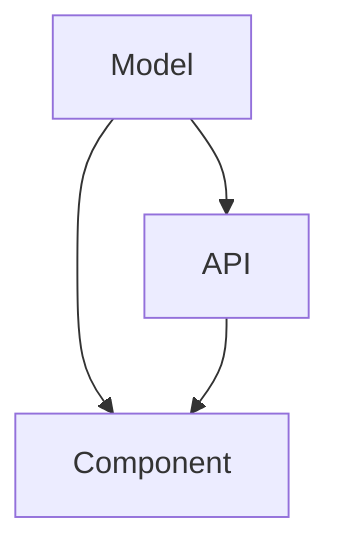

# Phase 1.75: Schema Definition

## Purpose
Generate a comprehensive schema.ts file that defines all data structures, APIs, and their relationships based on the masterplan.md.

## Instructions
1. Review masterplan.md to identify:
   - Data models
   - API endpoints
   - Component interfaces
   - Third-party integrations

2. Generate a TypeScript schema file containing:
```typescript
interface ProjectSchema {
  // Data Models
  models: {
    [modelName: string]: {
      fields: Record<string, {
        type: string;
        required: boolean;
        constraints?: {
          min?: number;
          max?: number;
          pattern?: string;
          enum?: string[];
        };
        references?: string;
      }>;
      relations: Record<string, {
        type: "oneToOne" | "oneToMany" | "manyToMany";
        with: string;
        inverse?: string;
      }>;
    };
  };

  // API Endpoints
  apis: {
    [endpointName: string]: {
      path: string;
      method: "GET" | "POST" | "PUT" | "DELETE";
      auth: boolean;
      input?: string;  // References model
      output?: string; // References model
    };
  };

  // UI Components
  components: {
    [componentName: string]: {
      props: Record<string, {
        type: string;
        required: boolean;
      }>;
      state?: Record<string, {
        type: string;
      }>;
    };
  };
}
```

3. Generate dependency graph:


4. Validation rules:
   - All referenced types must exist
   - Circular dependencies must be documented
   - Auth requirements must be specified
   - Required fields must be marked

## Output
Generate schema.ts with complete type definitions for:
- All data models
- API contracts
- Component interfaces
- Relationships and constraints

This schema will be used to validate Phase 2 stubs and Phase 3 implementations.
